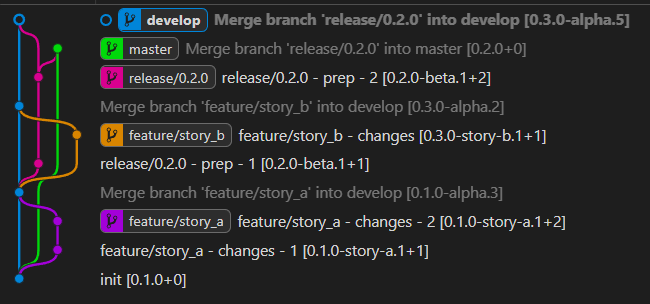

# GitVersion Rehearsals

A simple idea with a simple implementation; script predicted Git activity to demonstrate how branching and version strategies will play out.

[GitVersion](https://gitversion.net/) is used to generate version numbers; the version number generated for each commit is appended to the end of the first line of the message. The full GitVersion output is added to the 'body' of each commit message.

Then using a Git log viewer of your choice, one can get a graphical representation of the branching and versioning that has occurred to communicate to colleagues. A recommendation is to use the 'GitGraph' extension to VS Code, which works particularly nicely, and VS Code handles very well the case of multiple repos loaded in the current workspace.

For VS Code development, open the repo via the `.code-workspace` file provided.

### GitFlow Basic branching and versioning with GitVersion



## Pre-requisites

- Git
- Powershell (any version will do)
- Docker (Linux containers) _OR_ dotnet CLI

## Use

- Choose the way you want to invoke GitVersion; either via Docker Linux Container, or natively on the host via the Dotnet Tool CLI. By default, dotnet CLI will be used.
- Choose the 'rehearsal' you want to run; there are a number scripted in the `rehearsals` folder.

## Run Rehearsals

A rehearsal script can be run by specifying it's name without the file extension. e.g.

(via dotnet CLI)

```powershell
.\rehearse-git.ps1 gitflow-basic -ErrorAction stop -Verbose
```

(via Docker)

```powershell
.\rehearse-git.ps1 gitflow-basic -ErrorAction stop -Verbose -UseDocker
```

By default, this will create an `git-rehearsal-output` output folder as a sibling to the `git-rehearsal` repository folder.

This can be customised:

```powershell
.\rehearse-git.ps1 gitflow-basic -OutputRootPath c:\somewhere -ErrorAction stop -Verbose
```
